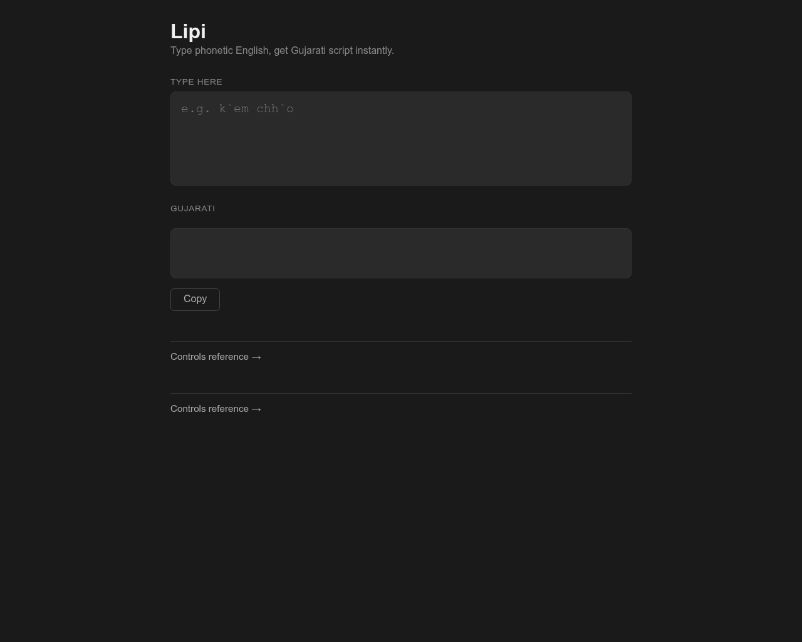

# Lipi
Lipi is a Gujarathi phonetic system that converts english text into Gujarathi. Basically, you type english sounds and it turns it into Gujurati.

## Screenshot
Lipi's [website](https://lipi.up.railway.app):

## Why Lipi

I built Lipi because I wanted a faster way to message my family in Gujarati. The standard Gujarati keyboard is frustrating and led to me hunting for characters, switching layouts, losing though mid-sentence. I was getting by in English just to avoid the friction.

Then I came across Pinyin, the phonetic input system used for Chinese. You just type how the word sounds in Roman letters and it figures out the characters.I couldn't understand why something like that didn't exist for Gujarati — or most other Indic scripts for that matter.

That thought led me to build "Lipi". I started looking into it, and eventually landed on a word that felt right for the project: *lipi* (લિપિ) — which means *script* in Gujarati. 

Lipi is my attempt to make typing Gujarati feel as natural as typing English.

## Lipi's Website
[lipi.up.railway.app](https://lipi.up.railway.app)

## Controls
See [CONTROLS.md](CONTROLS.md) for the full mapping reference.

## Quick Example
| Type           | Gujarati |
|----------------|----------|
| `k'em chh'o`   | કેમ છો   |
| `p-r'em`       | પ્રેમ    |

## Tickets

### High Priority

- [x] Core translation engine (`core/`)
  - [x] Vowel mapping
    - [x] Short vowels (a, i, u)
    - [x] Long vowels (aa, ii, uu)
    - [x] Complex vowels (e, ai, o, au)
  - [x] Consonant mapping
    - [x] Velar consonants (k, kh, g, gh, ng)
    - [x] Palatal consonants (ch, chh, j, jh, ny)
    - [x] Retroflex consonants (T, Th, D, Dh, N)
    - [x] Dental consonants (t, th, d, dh, n)
    - [x] Labial consonants (p, ph, b, bh, m)
    - [x] Approximants (y, r, l, v)
    - [x] Sibilants (sh, Sh, s)
    - [x] Aspirate (h)
    - [x] Special (L, ksh, gny)
  - [x] Matra support (`'` or `x` prefix)
    - [x] Short matras (i, u)
    - [x] Long matras (aa, ii, uu)
    - [x] Complex matras (e, ai, o, au)
  - [x] Longest match parser
    - [x] Length 3 matching
    - [x] Length 2 matching
    - [x] Length 1 matching
    - [x] Fallback passthrough
  - [x] Conjunct consonants
    - [x] Design conjunct syntax (`-` as halant connector)
    - [x] Common conjuncts (ક્ત, સ્ત, ન્ત)
    - [x] Halant support (્)
    - [x] Parser support for conjuncts
    - [x] Add conjuncts to CONTROLS.md
  - [x] Extended characters
    - [x] Anusvara (ં)
    - [x] Visarga (ઃ)
    - [x] Chandrabindu (ઁ)
  - [x] Numbers
    - [x] Gujarati digit mapping (૦-૯)
    - [ ] Auto convert or manual trigger
  - [x] Tests
    - [x] Unit test each vowel
    - [x] Unit test each consonant
    - [x] Unit test each matra
    - [x] Unit test full sentences
    - [x] Unit test edge cases
    - [x] Unit test conjuncts
    - [x] Unit test special characters
    - [x] Benchmark parser performance

- [x] Web server (`server/`)
  - [x] Setup
    - [x] Create server/main.go
    - [x] net/http router setup
    - [x] Port configuration
    - [x] Graceful shutdown
  - [x] Endpoints
    - [x] POST /transliterate
      - [x] Parse request body
      - [x] Call core.Transliterate
      - [x] Return response
      - [x] Handle empty input
      - [ ] Handle invalid UTF-8
    - [x] GET / (serve frontend)
      - [x] Embed static files with go:embed
      - [x] Serve index.html
      - [x] Serve CSS and JS
      - [x] Serve controls.html
  - [ ] Middleware
    - [ ] CORS headers
    - [ ] Rate limiting
    - [ ] Request logging
    - [ ] Error handling middleware
  - [ ] Tests
    - [ ] Unit test each endpoint
    - [ ] Integration tests

- [x] Web frontend (`web/`)
  - [x] Setup
    - [x] Create web/index.html
    - [x] Create web/style.css
    - [x] Create web/main.js
  - [x] Input
    - [x] Live input text box
    - [ ] Debounce API calls
    - [x] Placeholder text with example
  - [x] Output
    - [x] Live Gujarati output display
    - [x] Large readable font
    - [x] Copy to clipboard button
  - [x] Controls reference panel
    - [x] Vowel table
    - [x] Consonant table
    - [x] Matra table
  - [x] Autocomplete mode
    - [x] Toggle autocomplete on/off (button or keyboard shortcut)
    - [x] On spacebar, transliterate current word in-place
    - [x] Preserve cursor position after replacement
    - [x] Works in both web and desktop frontends
  - [ ] Sharing
    - [ ] Shareable URL with encoded text
    - [ ] Share button
    - [ ] Copy link button

- [x] Mobile app (`mobile/`)
  - [x] Setup
    - [x] Initialize Expo project (expo-router)
    - [x] Font loading (Inter via expo-google-fonts)
    - [x] Splash screen
    - [x] Navigation stack (index + controls screens)
    - [x] Error boundary
  - [x] Core engine
    - [x] Port transliterate logic to TypeScript (`utils/transliterate.ts`)
    - [x] Vowel mapping
    - [x] Matra mapping
    - [x] Consonant mapping
    - [x] Longest match parser
  - [x] Main screen (`app/index.tsx`)
    - [x] Phonetic text input
    - [x] Live Gujarati output
    - [x] Copy to clipboard
    - [x] Haptic feedback on copy
    - [x] Link to controls reference screen
  - [x] Controls reference screen (`app/controls.tsx`)
    - [x] Vowel table
    - [x] Matra table
    - [x] Consonant table
    - [x] Back navigation
  - [x] Design
    - [x] Dark mode
  - [ ] Features
    - [ ] Autocomplete mode (transliterate word on space)
    - [ ] Share / copy link
  - [ ] Tests
    - [ ] Unit test transliterate util
    - [ ] Component snapshot tests
  - [ ] Publishing
    - [ ] Configure EAS Build
    - [ ] iOS App Store submission
    - [ ] Android Play Store submission

- [ ] Desktop app (`desktop/`)
  - [x] Setup
    - [x] Install Wails
    - [x] Initialize Wails project
    - [x] Connect core engine to Wails
    - [x] Bind Transliterate function
  - [ ] UI
    - [x] Reuse web frontend
    - [ ] Native window controls
    - [ ] App icon design
    - [ ] Splash screen
  - [ ] Windows build
    - [ ] Cross-compile from Linux
    - [ ] Windows installer (.exe)
    - [ ] Windows icon (.ico)
  - [ ] Linux build
    - [ ] .deb package
    - [ ] .AppImage package
    - [ ] AUR package (Arch Linux)

- [ ] Documentation
  - [ ] README.md
    - [x] Title and description
    - [x] Live demo link
    - [ ] Installation instructions
    - [ ] Quick start example
    - [ ] Screenshot or demo gif
    - [x] Link to CONTROLS.md
  - [x] CONTROLS.md
    - [x] Vowel table
    - [x] Consonant table
    - [x] Matra table
    - [x] Examples
    - [x] Conjunct examples
    - [ ] Number examples

### Low Priority

- [x] Docker
  - [x] Production image
    - [x] Create Dockerfile
    - [x] Multi-stage build
    - [x] Minimize image size
    - [ ] Non-root user setup
    - [ ] Health check endpoint
  - [ ] Build environment
    - [ ] Create Dockerfile.build
    - [ ] Go cross-compilation setup
    - [ ] Windows target (GOOS=windows)
    - [ ] Linux target (GOOS=linux)
    - [ ] Build output artifacts
  - [ ] Docker Compose
    - [ ] Create docker-compose.yml
    - [ ] Web server service
    - [ ] Volume mounts
    - [ ] Environment variables
  - [ ] CI/CD (GitHub Actions)
    - [ ] Create .github/workflows/
    - [ ] Build and test on push
      - [ ] Run Go tests
      - [ ] Build all targets
      - [ ] Report coverage
    - [ ] Auto publish Docker image
      - [ ] Push to Docker Hub
      - [ ] Tag with version
      - [ ] Tag with latest
    - [ ] Auto release binaries
      - [ ] Build Windows binary
      - [ ] Build Linux binary
      - [ ] Create GitHub release
      - [ ] Upload binaries to release

- [ ] Desktop system integration
  - [ ] System tray icon
  - [ ] Global keyboard shortcut to open
  - [ ] Minimize to tray
  - [ ] Start on boot option
  - [ ] Auto updater
    - [ ] Version checking
    - [ ] Download and install updates
    - [ ] Release notes display
  - [ ] Code signing (Windows)

- [ ] Mobile app icon & assets
  - [ ] Design app icon
  - [ ] Generate all icon sizes (iOS + Android)

- [ ] Web frontend polish
  - [ ] Mobile responsive layout
  - [ ] Dark mode toggle
  - [ ] Font size controls
  - [ ] Smooth transitions
  - [ ] Keyboard shortcut hints
  - [ ] Character count display
  - [ ] Collapsible controls panel
  - [ ] Search/filter controls
  - [ ] Social media meta tags

- [ ] Contributing & API docs
  - [ ] CONTRIBUTING.md
    - [ ] How to add new mappings
    - [ ] How to run tests
    - [ ] Pull request guidelines
    - [ ] Code style guide
  - [ ] API docs
    - [ ] Endpoint reference
    - [ ] Request/response examples
    - [ ] Error codes

- [ ] Polish
  - [ ] Edge cases
    - [ ] Punctuation passthrough
    - [ ] Whitespace handling
    - [ ] Mixed Gujarati/English input
    - [ ] Very long input handling
  - [ ] Performance
    - [ ] API response time targets
    - [ ] Frontend debounce tuning
  - [ ] Accessibility
    - [ ] Screen reader support
    - [ ] Keyboard navigation
    - [ ] High contrast mode
    - [ ] Font size accessibility
  - [ ] Server load testing